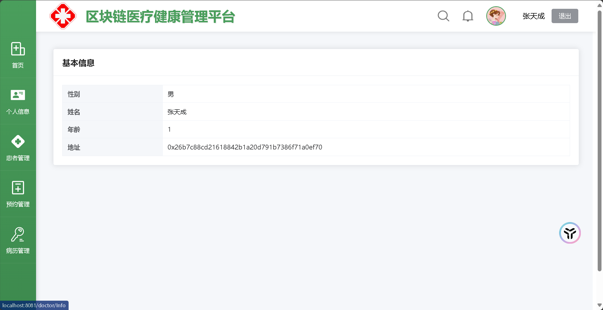

# **区块链医疗健康管理系统**

> 基于SpringBoot+Vue+FISCO-BCOS的医疗健康管理平台

## 🌟 简介
本项目是基于区块链技术的医疗健康管理系统，通过FISCO-BCOS联盟链实现医疗数据的安全存证与可信共享。
这个项目目前不维护了，可以看最新的
系统包含：
- 👨⚕️ **医生端**：患者管理、电子病历存证、预约审核
- 👨💻 **患者端**：在线挂号、预约查询、病历查看
- 🔒 **区块链**：关键医疗数据上链存证，保障数据不可篡改

## 🛠️ 安装指南

### 环境要求
- JDK 1.8+
- Node.js 18+
- MySQL 8.0+
- FISCO-BCOS节点（[搭建指南](https://fisco-bcos-documentation.readthedocs.io/)）

### 后端部署
```bash
cd MedicalBackend/backend
mvn clean install
```

### 前端部署

```
nvm use 18
cd medical
npm install
# 配置vite.config.ts中的API地址
npm run dev
```

## 🖥️ 使用说明

### 医生界面

| 功能模块     | 说明                      |
| :----------- | :------------------------ |
| 首页         | 显示当日预约/患者人数统计 |
| 个人信息     | 医生信息                  |
| 患者管理     | 查看/搜索患者基本信息     |
| 预约审核     | 审批患者预约申请          |
| 电子病历管理 | 创建病历并生成区块链存证  |

### 患者界面

| 功能模块 | 说明                     |
| :------- | :----------------------- |
| 个人信息 | 患者信息                 |
| 挂号管理 | 挂号预约                 |
| 预约管理 | 查看个人预约信息         |
| 我的病历 | 查看区块链存证的加密病历 |

## 页面展示

### 👨⚕️ 医生端界面

#### 1.首页


#### 2.个人信息



#### 3.患者管理


#### 4. 预约管理

*交互流程：*

1. 筛选待处理预约申请
2. 查看患者历史就诊记录
3. 通过数字签名确认审批【暂未实现】


#### 5. 病历管理

*交互流程：*

- 通过时间轴展示病历创建过程
- 查看区块链存证状态实时显示（图标：✅ 已填写 / ⏳ 待确认）
- 支持病历摘要快速检索


### 👨💻 患者端界面

#### 1.个人信息


#### 2. 挂号管理


#### 3. 预约管理

*状态标识说明：*

| 状态图标 | 含义       | 操作权限 |
| :------- | :--------- | :------- |
| 🟢        | 预约成功   | 可取消   |
| 🟡        | 待医生确认 | 不可操作 |


### 🔐 公共页面

#### 1.注册界面


#### 2.登陆界面


## 💻 维护者

- [zhengcookie] - 系统开发工程师（[z2132085753@outlook.com]）

##  版本历史

- 1.0.0 (2023-08-20)[demo]
  - 实现核心医疗存证功能
  - 完成医患双端基础功能模块
  - 集成FISCO-BCOS存证SDK

## 📄 许可证

本项目采用 [MIT License](LICENSE)

##  致谢

- FISCO-BCOS开源社区提供区块链技术支持
