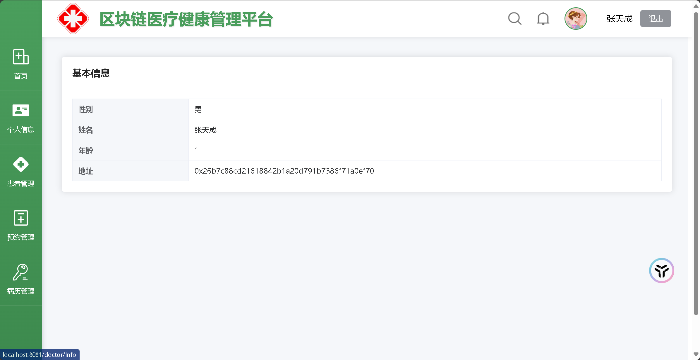
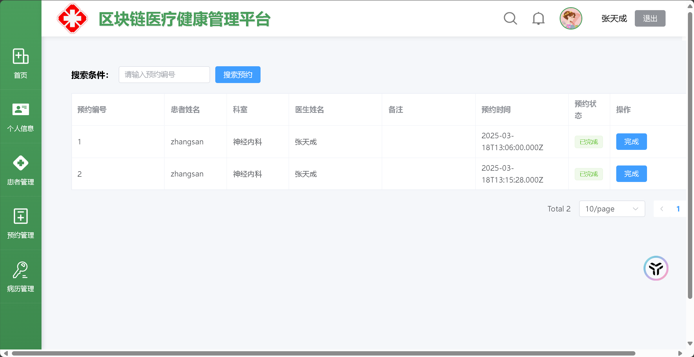
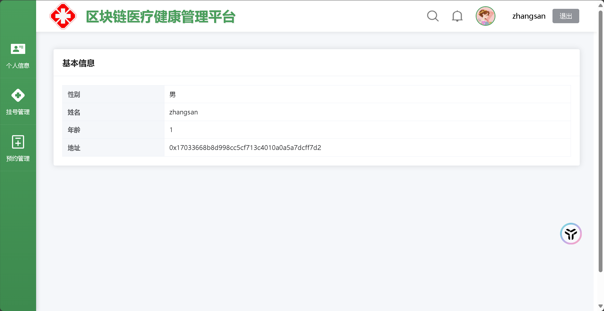
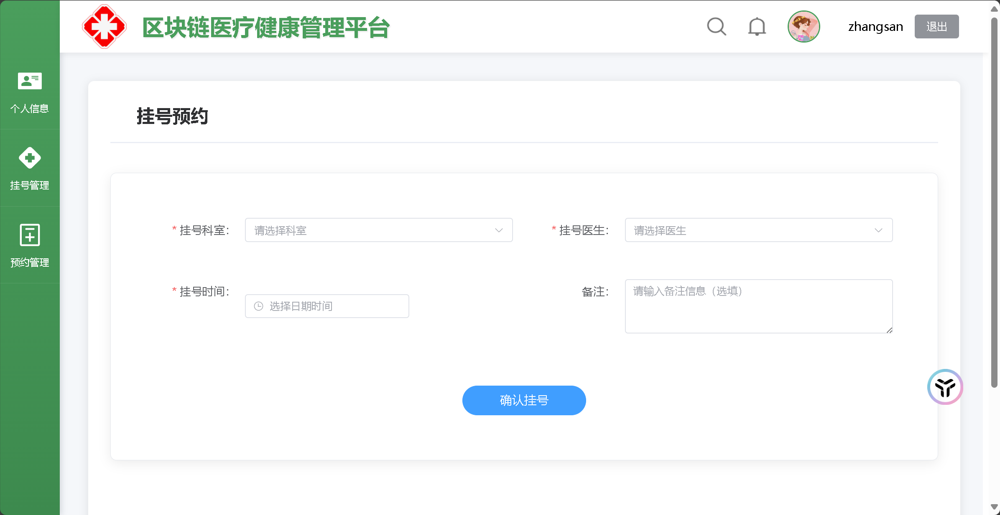
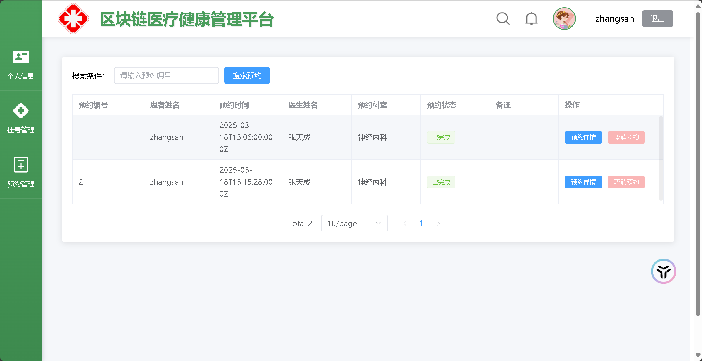
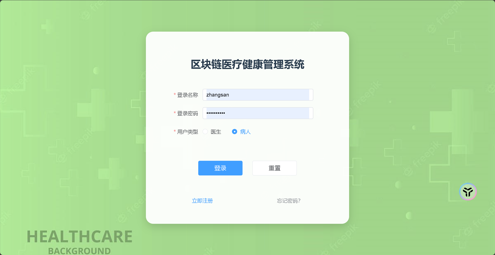

## 页面展示

### 👨⚕️ 医生端界面

#### 1.首页

#### 2.个人信息

#### 3.患者管理

#### 4. 预约管理

*交互流程：*

1. 筛选待处理预约申请
2. 查看患者历史就诊记录
3. 通过数字签名确认审批【暂未实现】

#### 5. 病历管理

*交互流程：*

- 通过时间轴展示病历创建过程
- 查看区块链存证状态实时显示（图标：✅ 已填写 / ⏳ 待确认）
- 支持病历摘要快速检索

### 👨💻 患者端界面

#### 1.个人信息

#### 2. 挂号管理

#### 3. 预约管理
*状态标识说明：*

| 状态图标 | 含义       | 操作权限 |
| :------- | :--------- | :------- |
| 🟢        | 预约成功   | 可取消   |
| 🟡        | 待医生确认 | 不可操作 |

### 🔐 公共页面

#### 1.注册界面

#### 2.登陆界面

